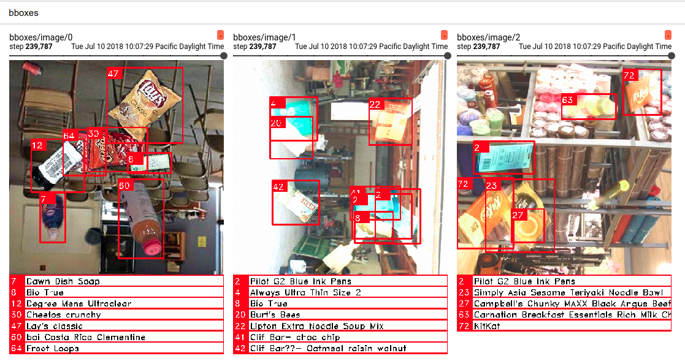
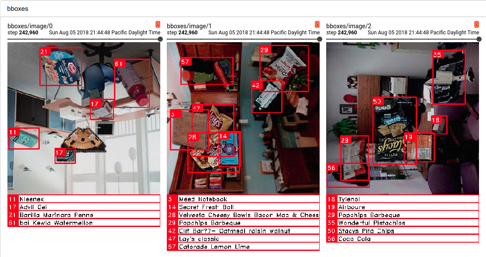

### Object Detection and Classification
Tensorflow implementation for real-time object detection and classification. This is a one-shot detector with network architecture similar to [RetinaNet](https://arxiv.org/abs/1708.02002).

Training is based on completely synthetic data built from 2D images of objects : [Cut, Paste and Learn: Surprisingly Easy Synthesis for Instance Detection](https://arxiv.org/abs/1708.01642)

### Training on your own dataset
* You will have to modify `dataset/data_reader.py` according to your data format.
 
* Training and model parameters can be set in `config.py`
 
* For single GPU training, simply run: 
```
python3 train.py
``` 
 
* For distributed training, first install [horovod](https://github.com/uber/horovod). Then run: 
```
mpirun -np 16 \
    -H server1:4,server2:4,server3:4,server4:4 \
    -bind-to none -map-by slot \
    -x NCCL_DEBUG=INFO -x LD_LIBRARY_PATH -x PATH \
    -mca pml ob1 -mca btl ^openib \
    python3 train_distributed.py
```

* Code for tf-summary for visualization during training can be found in `train.py`. 


### Pre-trained model
* Pre-trained model is available in `models/latest`. You may have a look at `inference.py` on how to use the frozen model. 
* This model uses Mobilenet backbone for real-time inference.
* Model is fully-convolutional and supports RGB image of any dimensions (multiple of 16).


### Results 
Here is what detections on some sample training (fake) images look like:



Here is the inference on **real** image:

